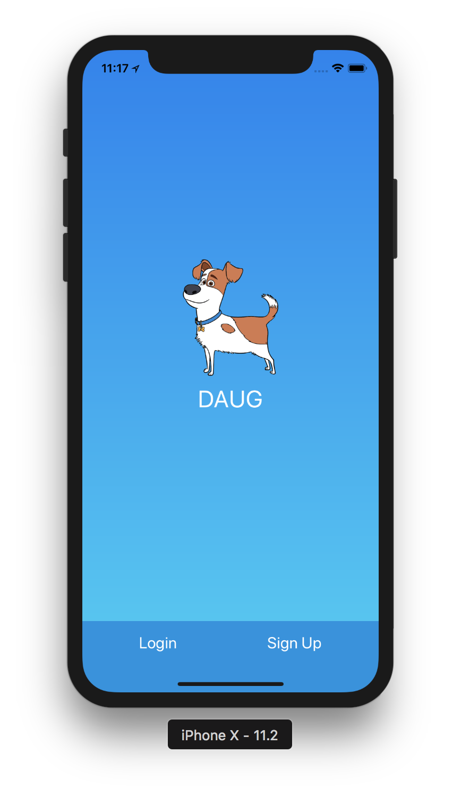
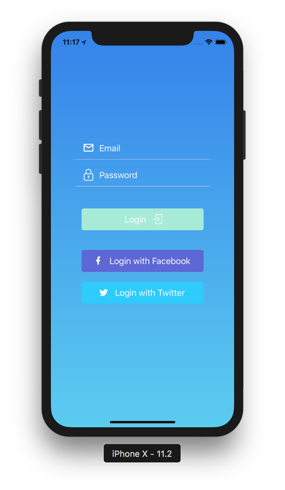
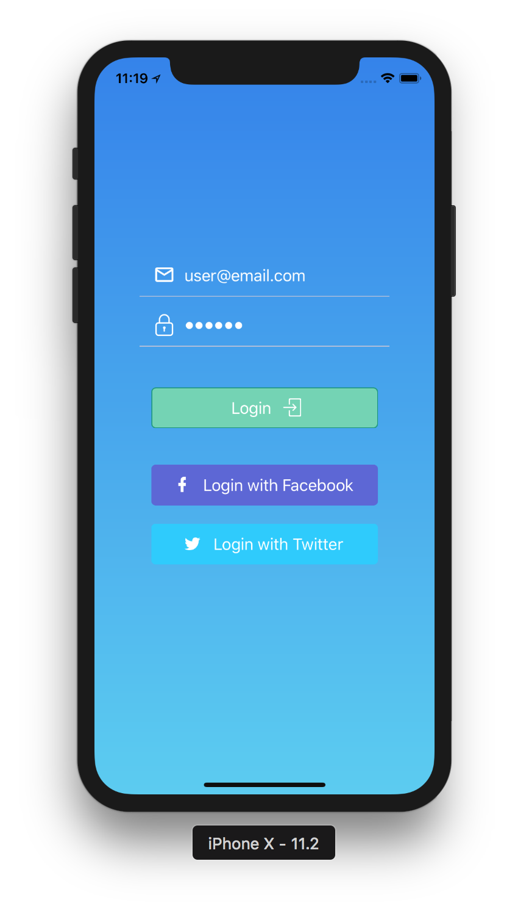
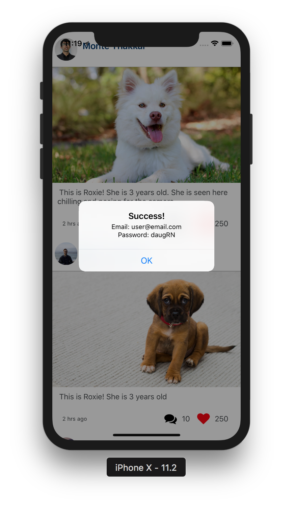
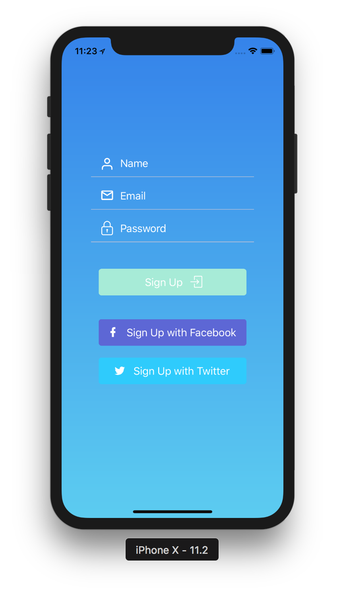
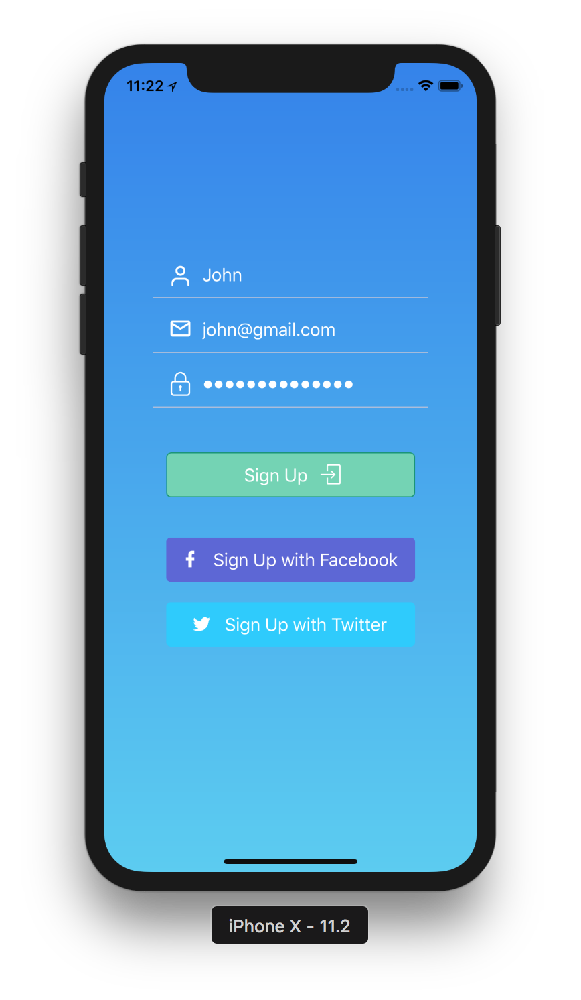
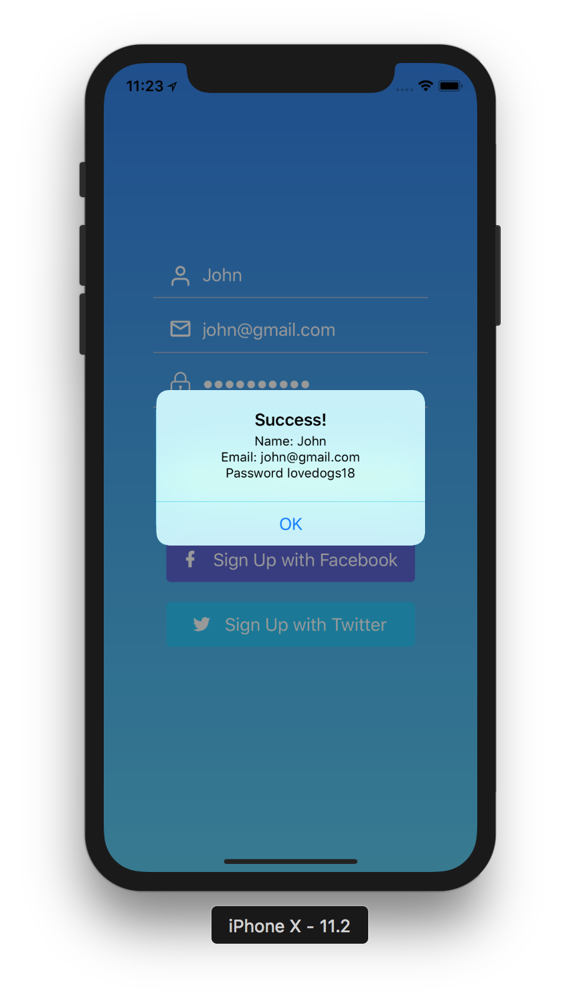
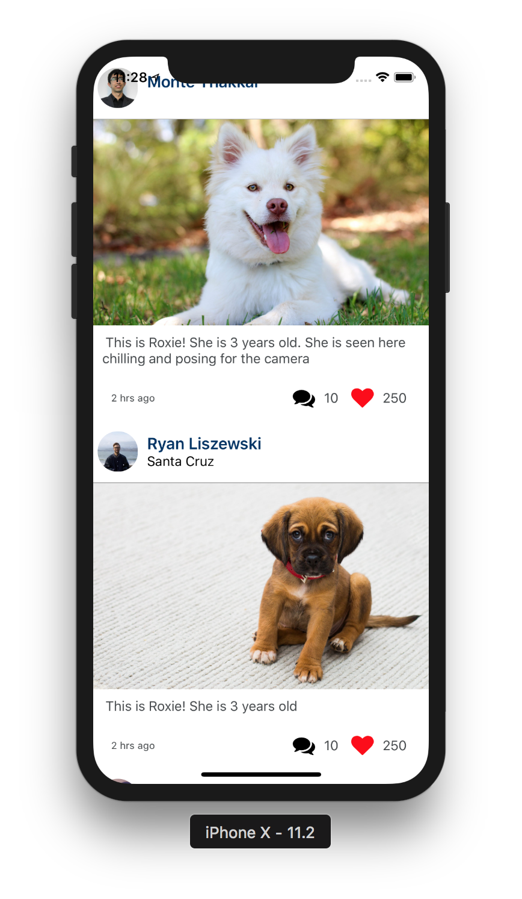
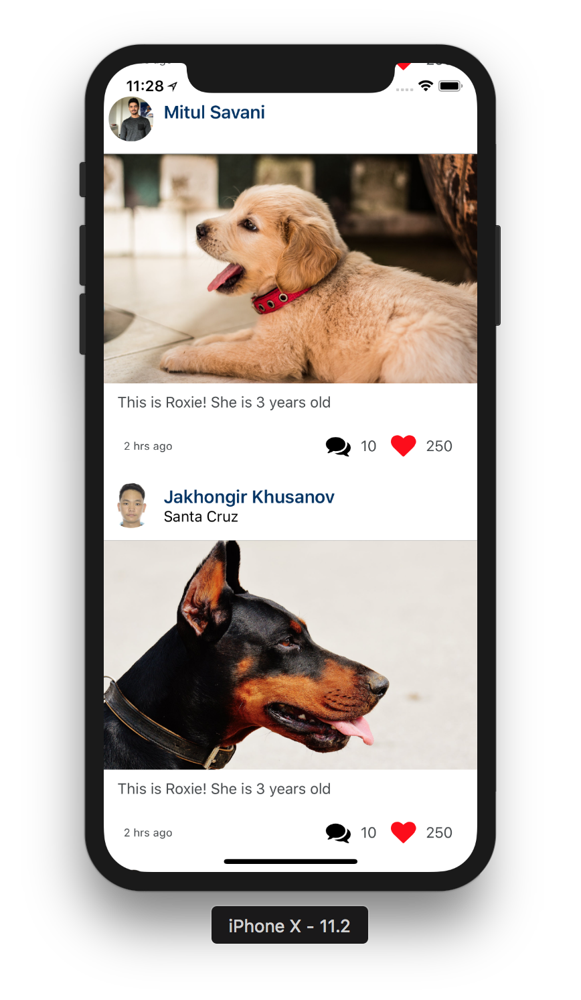
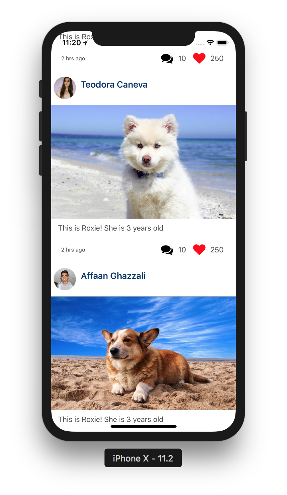

# Daug mobile app

This repo is the mobile app for Daug.

## What's Daug?

**Daug is a social network for pets.**

- Your pets can **sign up or login** using their paws.
- They can **upload selfies** or **post their thoughts** for other pets to see.
- They can also look at **other pets posts** and either **paw** (like) or **scratch** (dislike) it.

### [Demo - Try it on Expo](https://exp.host/@jkhusanov/daug-mobile)

## Getting started

```
git clone git@github.com:mobilespace/daug-mobile.git

exp start

exp ios
```

## Designs

Intro, Login & Sign Up screens are based on **Robinhood App**.

Profile screen is based on **Instagram**.

Social Feed screen is based on **Facebook**.

### Other design ideas

- [Login screen designs on Pinterest](https://www.pinterest.com/timoa/mobile-ui-logins/?lp=true)
- [Mobile UI on Dribble](https://dribbble.com/search?q=mobile+UI)
- [Instagram UI kit - Sketch file](https://www.sketchappsources.com/free-source/2023-instagram-based-ui-kit-sketch-freebie-resource.html)


## Assignment #1

### Objectives

- Learn how to build & organize screens in RN
- Learn advanced RN styling and use LinearGradient, Image, Icons & Custom Fonts
- Learn how to use mock data for prototyping UI screens
- Learn how to use NPM libaries such as React Native Elements, Expo & React Native Vector Icons

### TODO

- [x] Design & build an Intro Screen
  - [ ] :star: **Bonus:** Add [Snap Carousel](https://github.com/archriss/react-native-snap-carousel) with [Lottie animations](https://docs.expo.io/versions/latest/sdk/lottie.html) to Intro Screen
- [x] Design & build an Signup Screen
  - [x] :star: **Bonus:** Add buttons to sign up with Facebook & Twitter
- [x] Design & build an Login Screen
  - [x] :star: **Bonus:** Add buttons to login with Facebook & Twitter
- [ ] Design & build an Profile Screen
  - [x] :star: **Bonus:** Add the Logout button
- [x] Design & build an Social Feed Screen with [Mock Data](https://raw.githubusercontent.com/mobilespace/daug-mobile/c4d4a331564ee490e1162f3733f3023afe3defc3/app/utils/constants.js)
- [x] Attach screenshots/gif of screens to `README.MD`

### Screenshots

<div style={{display: flex; flex-direction: row}}>
  
</div>
<div style={{display: flex; flex-direction: row}}>
  
  
  
</div>
<div style={{display: flex; flex-direction: row}}>
  
  
  
</div>
<!-- <div style={{display: flex; flex-direction: row}}>
  
</div> -->
<div style={{display: flex; flex-direction: row}}>
  
  
  
</div>

## Assignment #2

### Objectives

- Learn how to build navigation for Daug app using [React Navigation](https://reactnavigation.org/)
- Learn mobile design patterns for navigation & screen layouts
- Learn how to quickly build RN screens and hook them up using navigation

### TODO

- [ ] Understand the 3 main navigation patterns for mobile apps:
  - [ ] [StackNavigator](https://reactnavigation.org/docs/hello-react-navigation.html#creating-a-stacknavigator)
  - [ ] [TabNavigator](https://reactnavigation.org/docs/tab-based-navigation.html)
  - [ ] [DrawerNavigator](https://reactnavigation.org/docs/drawer-based-navigation.html)
- [ ] Setup a **IntroStack** (using StackNavigator) for the Intro Screen (root), Login Screen (push) & Sign Up Screen (push)
- [ ] Setup a **HomeTabs** (using TabNavigator) for the Social Feed Screen (default) and Profile Screen
- [ ] Setup a **RootNavigator** (using StackNavigator) with the **IntroStack** & **HomeTabs** with `mode: "modal"`
- [ ] Design & build an Edit Profile Screen
- [ ] Setup a **ProfileStack** (using StackNavigator) for the Profile Screen (root) and Edit Profile Screen (push)
- [ ] Design & build an Post Details Screen
- [ ] Design & build an Create Post Screen
- [ ] Setup a **SocialStack** (using StackNavigator) for the Social Feed Screen (root), Post Details Screen (push) & Create Post Screen (push)
- [ ] :star: **Bonus:** Setup a **HomeNavigator**(using DrawerNavigator) with the **HomeTabs** (as root) and update **RootNavigator** to use **HomeNavigator** instead of **HomeTabs**
- [ ] :star: **Bonus:** Use [SafeAreaView](https://reactnavigation.org/docs/handling-iphonex.html) on each screen to support iPhone X
- [ ] Attach working gif of navigation to `README.MD`

### Demo

## Submission

Once you have completed each assignment above, please create a new issue on this repo with the title as your name and add the link to your repo in the description. Additionally please publish your Expo app and add the link as a comment on your submission issue. One of the TA's will review your code and add your name to the list of completed submissions below if all looks good.

### Completed submissions

- [ ] Ryan Liszewski
- [ ] Thomas Zhu
- [ ] Bhavesh Chowdhury
- [ ] Sukhjit Singh
- [ ] Prakash Gurung
- [ ] Nicholas Szeto
- [ ] Emanuel Saunders
- [ ] William Hua
- [ ] Mitul Savani
- [ ] Jakhongir Khusanov
- [ ] Teodora Caneva
- [ ] Affaan Ghazzali
- [ ] Girish Rawat
- [ ] Karan Gupta

## Problems?

In case you run into any problems or issues, please post it on #questions channel on the MobileSpace Slack.

## Finally

For any other questions about this repo or MobileSpace in general please reach out to [**@monte9**](https://github.com/monte9) on Github.
